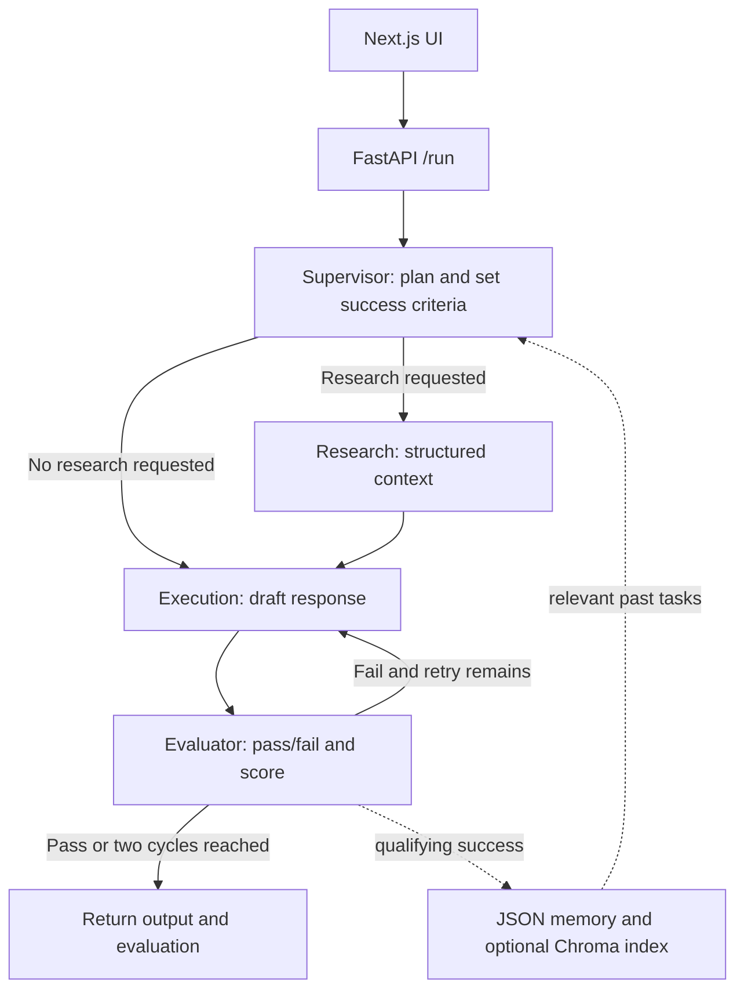

# AgentOps AI

AgentOps AI is a full-stack demo for running a user task through a controlled, multi-agent workflow. A FastAPI service exposes a LangGraph pipeline, and a Next.js interface lets users submit goals, inspect evaluated outputs, and browse qualifying past runs.

> This repository is a learning and prototyping project, not a production-ready service.

## Research question

**How can an LLM task system make work more inspectable and bounded by separating planning, context gathering, generation, and quality checks, while reusing successful past work?**

### Answer

This project demonstrates one architectural answer: a Supervisor creates a structured plan and acceptance criteria; an optional Research Agent prepares context; an Execution Agent drafts the response; and an Evaluator scores it against those criteria. A failed evaluation can return the draft for repair, with the graph capped at two execution/evaluation cycles. Passing outputs with a score of at least 8 can be saved as memory and considered during later planning.

The implementation makes agent responsibilities, state transitions, evaluation results, and retry limits explicit. This is a working prototype of that design, not evidence that it improves quality over a single-agent baseline: the repository does not include benchmark results or a measured comparison.

## How a task runs



The API returns the final output, evaluation, and whether memory informed planning. Internal plans, research context, and traces are not included in the `/run` response.

### Important implementation boundaries

- The Research Agent currently asks Gemini to produce structured research context; it does not itself fetch or verify web sources.
- A DuckDuckGo search tool is present in `tools/`, but the normal graph call does not pass a tool registry to the Execution Agent. The `/run` workflow therefore does not currently invoke that search tool.
- Offline mode substitutes deterministic placeholder planning, research, execution, and evaluation behavior. Its passing score is a structural test fixture, not a quality measurement. Memory retrieval may still attempt to generate a Google embedding, so offline mode should not be treated as a guarantee of zero external requests when memory is enabled.
- No result screenshots or benchmark-result tables are checked into this repository. No performance or quality results are claimed here.

## Features

- Explicit LangGraph state and role-separated agent steps
- Conditional research routing and evaluator-directed, bounded repair
- Gemini models configurable per agent
- Local JSON storage for successful task memories, with optional Chroma semantic retrieval
- Optional LangSmith and Langfuse tracing, disabled by default
- Web UI for goal submission, evaluation details, and memory history
- Docker Compose setup for the frontend and API

## Getting started

### Requirements

- Python 3.10 or newer
- Node.js 20 or newer for the frontend
- A [Google Gemini API key](https://aistudio.google.com/apikey) for live model runs
- Docker Desktop or Docker Engine with the Compose plugin, if using Docker

### Clone

```bash
git clone https://github.com/hassaan4717/AgentOps-AI.git
cd AgentOps-AI
```

### Run locally

Create and activate a Python environment from the repository root:

```powershell
python -m venv .venv
.\.venv\Scripts\Activate.ps1
python -m pip install -r requirements.txt
```

On macOS or Linux, activate it with `source .venv/bin/activate` instead. Install frontend dependencies:

```bash
cd frontend
npm ci
cd ..
```

In the terminal that will run the backend, set the Gemini key (PowerShell shown):

```powershell
$env:GOOGLE_API_KEY = "your-google-api-key"
```

For a structural run without Gemini agent completions, set `$env:OFFLINE_MODE = "1"` in that terminal. In Bash, use `export GOOGLE_API_KEY="your-google-api-key"` or `export OFFLINE_MODE=1`.

Start the API from the repository root:

```bash
python -m uvicorn backend.main:app --reload --port 8000
```

In a second terminal, start the frontend:

```bash
cd frontend
npm run dev
```

Open the app at <http://localhost:3000>. The API is at <http://localhost:8000>, with interactive documentation at <http://localhost:8000/docs>.

### Run with Docker Compose

Create the environment file, add your Gemini key for live runs, and start both services:

```powershell
Copy-Item .env.example .env
```

Edit `.env`, then run:

```bash
docker compose up --build
```

Compose serves the frontend on port 3000 and the API on port 8000. The browser-facing API URL is compiled into the frontend image; set `NEXT_PUBLIC_API_URL` in `.env` before building if the browser must reach the API at a different address. Application data is stored in the `agentops_data` volume. Stop services with `docker compose down`; remove the volume and its data with `docker compose down --volumes`.

## API

| Method | Endpoint | Purpose |
|---|---|---|
| `GET` | `/health` | Health status and service version |
| `GET` | `/` | API information and documentation links |
| `POST` | `/run` | Execute a task; `goal` must be 3–500 characters |
| `GET` | `/history` | List summaries of stored successful tasks |

Example request:

```json
{
  "goal": "Explain the benefits of vector databases for semantic search"
}
```

The response includes `final_output`, an `evaluation` object (`passed`, `score`, and `reasons`), and `memory_used`. Internal agent state is intentionally omitted.

With `OFFLINE_MODE=1`, a run returns a fixed placeholder rather than an answer generated by an agent. For example, `final_output` is `OFFLINE_MODE: execution is disabled; this is a placeholder output.` and the evaluator returns a heuristic score. This mode is useful for checking API wiring, not for judging answer quality.

## Configuration

| Variable | Purpose |
|---|---|
| `GOOGLE_API_KEY` | Gemini and Google embedding credentials |
| `GEMINI_MODEL` | Supervisor model; defaults to `gemini-2.0-flash` |
| `GEMINI_RESEARCH_MODEL` | Research Agent model |
| `GEMINI_EXECUTION_MODEL` | Execution Agent model |
| `GEMINI_EVALUATOR_MODEL` | Evaluator model |
| `OFFLINE_MODE` | `1` enables deterministic placeholder agent behavior |
| `NEXT_PUBLIC_API_URL` | API URL embedded in the frontend at build time |
| `OBSERVABILITY_ENABLED` | `1` enables optional tracing |
| `LANGSMITH_API_KEY`, `LANGSMITH_PROJECT` | Optional LangSmith configuration |
| `LANGFUSE_PUBLIC_KEY`, `LANGFUSE_SECRET_KEY`, `LANGFUSE_HOST` | Optional Langfuse configuration |
| `AGENTOPS_DATA_DIR` | Memory data directory; defaults to `memory/` locally |

See [.env.example](.env.example) for the complete template. Do not commit API keys or populated environment files.

## Memory and observability

Memory records are written to local JSON storage after a passing evaluation with a score of at least 8. The store retains at most 100 records and prunes records older than 90 days. Chroma is used as a secondary semantic index; Google embeddings are required for semantic lookup and indexing. Memory is advisory: an unavailable or empty store does not prevent planning from continuing.

Tracing is disabled unless `OBSERVABILITY_ENABLED=1`. When enabled, the project can emit spans to LangSmith and Langfuse if their respective credentials are configured. These integrations are optional and should be configured with care when handling user-submitted tasks.

## Development and tests

The included API tests run in offline mode. Install pytest if it is not already available, then run from the repository root:

```bash
python -m pip install pytest
python -m pytest tests/ -v
```

The `Makefile` also provides `make test`, `make lint`, and local service targets for POSIX-style shells. See [CONTRIBUTING.md](CONTRIBUTING.md) for contribution guidance.

## Project layout

| Path | Contents |
|---|---|
| `backend/` | FastAPI app and run/history routes |
| `frontend/` | Next.js user interface |
| `src/agentops_ai_platform/agents/` | Supervisor, Research, Execution, and Evaluator logic |
| `src/agentops_ai_platform/graphs/` | LangGraph state and workflow |
| `memory/` | JSON memory and optional Chroma vector index |
| `observability/` | LangSmith and Langfuse helpers |
| `tools/` | DuckDuckGo web-search tool implementation |
| `tests/` | Offline-safe API smoke tests |

## Technology

| Area | Technologies |
|---|---|
| Agent workflow | LangGraph, LangChain, Google Gemini |
| API | FastAPI, Pydantic, Uvicorn |
| Memory | JSON, ChromaDB, Google embeddings |
| Interface | Next.js 14, React 18, TypeScript |
| Optional tracing | LangSmith, Langfuse |
| Deployment | Docker, Docker Compose |

## License

This project is licensed under the MIT License. See [LICENSE](LICENSE).
